# PrimeBill ISP Platform — Frontend

> **PrimeBill ISP Platform** (short brand: **PrimeBill**) is the React-based web application for the PRIMEBILL ISP PLATFORM multi-tenant ISP OSS/BSS platform. It provides tenant administration, client self-service, public captive portal functionality, network/NOC operations, billing, support, CRM, inventory, reporting, security, and PrimeBill ISP Platform administration.

[Branding & nomenclature → BRANDING.md](BRANDING.md)


---

# 1. Product Overview

PrimeBill ISP Platform (the frontend) is the presentation and interaction layer for the PrimeBill ISP Platform backend.

It provides three primary experiences:

1. **Tenant Admin Dashboard**
2. **Client Portal**
3. **Public Captive Portal**

It also provides a separate **Platform Administration Console** for cross-tenant PrimeBill operations.

---

# 2. Platform Scope

| Phase | Domain | Frontend Coverage |
|---|---|---|
| 01 | Platform | Admin, roles, permissions, tenants, SaaS plans, subscriptions, settings |
| 02 | Network Foundation | Routers, RADIUS, NOC, OLT, Fiber, ONT, IPAM interfaces |
| 03 | Customer Foundation | ISP plans, clients, accounts, wallets, enrichment |
| 04 | Billing | Taxes, discounts, invoices, payments, allocations, ledger, usage, refunds, notes, dunning |
| 05 | Inventory | Warehouses, suppliers, stock, purchase orders, assignments |
| 06 | Support | Departments, queues, categories, SLA, KB, tickets, maintenance, work orders |
| 07 | CRM / Communication | Leads, campaigns, CX, templates, communications, notifications, announcements, webhooks |
| 08 | Operations | RADIUS sessions, traffic, ONT history/events, SMS logs |
| 09 | Reporting | Dashboards, saved reports, report schedules |
| 10 | Security | Security events, devices, login history, MFA recovery |

---

# 3. Frontend Architecture

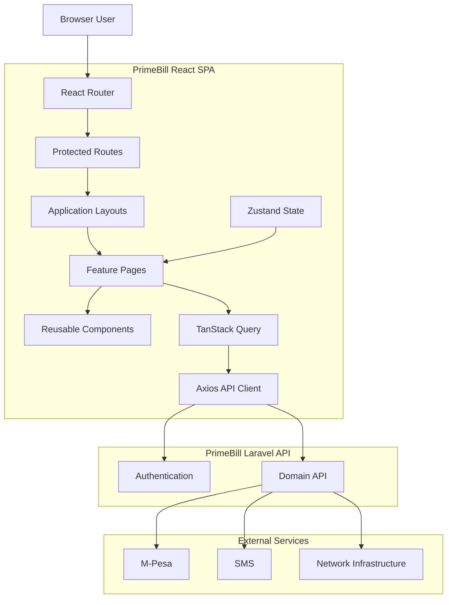

---

# 4. Application Experiences

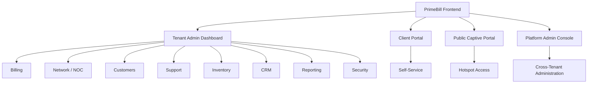

---

# 5. Phase 01 — Platform UI

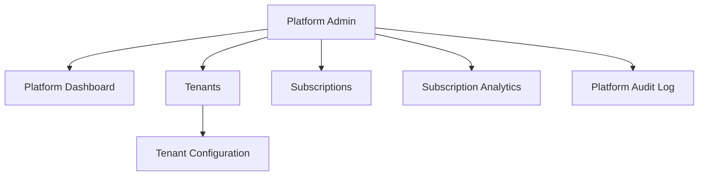

Relevant routes include:

| Route | Purpose |
|---|---|
| `/platform` | Platform dashboard |
| `/platform/tenants` | Tenant administration |
| `/platform/tenants/:id` | Tenant details/configuration |
| `/platform/subscriptions` | SaaS subscriptions |
| `/platform/analytics` | Subscription analytics |
| `/platform/audit-log` | Platform audit log |

---

# 6. Phase 02 — Network Foundation UI

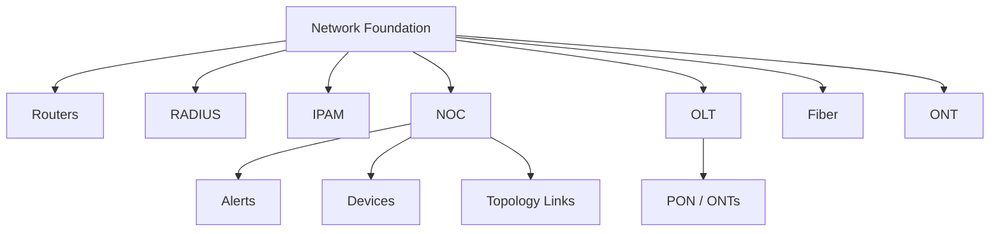

---

# 7. Phase 03 — Customer Foundation UI

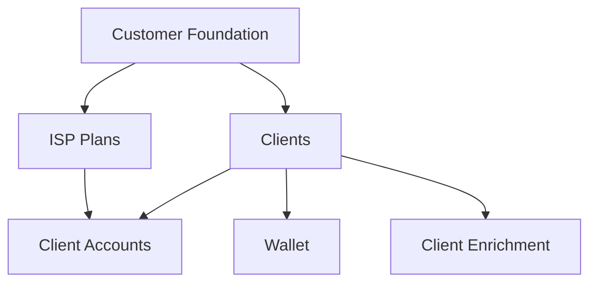

---

# 8. Phase 04 — Billing UI

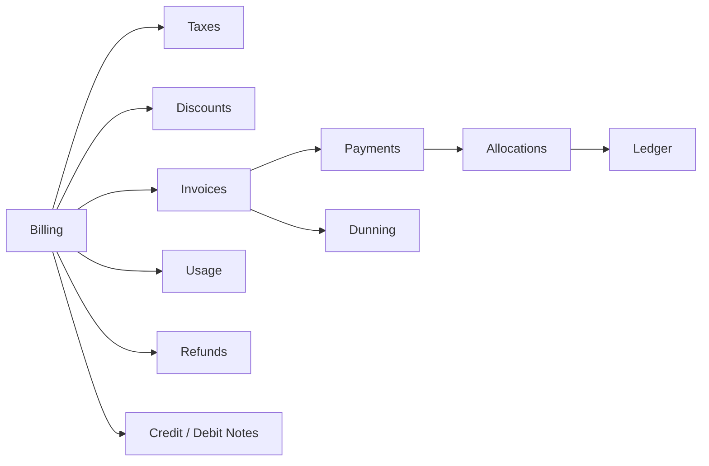

---

# 9. Phase 05 — Inventory UI

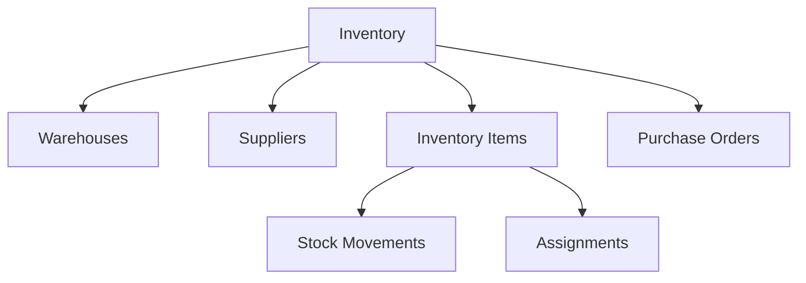

---

# 10. Phase 06 — Support UI

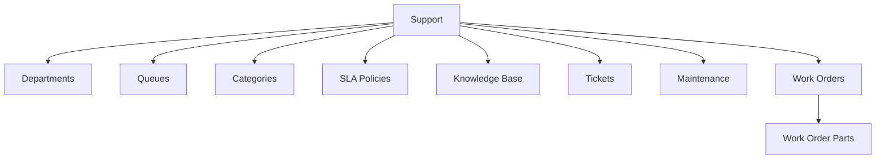

---

# 11. Phase 07 — CRM / Communication UI

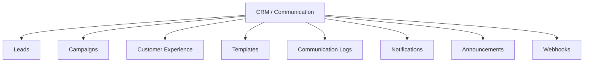

---

# 12. Phase 08 — Operations UI

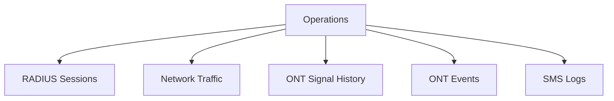

---

# 13. Phase 09 — Reporting UI

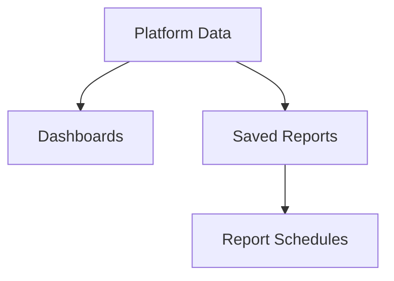

---

# 14. Phase 10 — Security UI

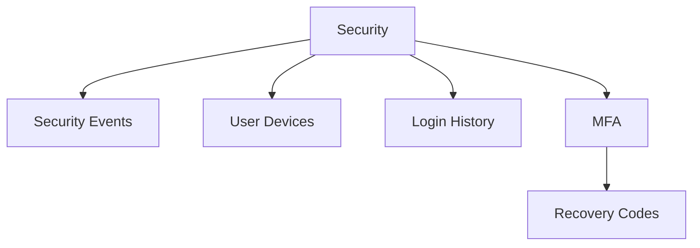

---

# 15. Admin Navigation Map

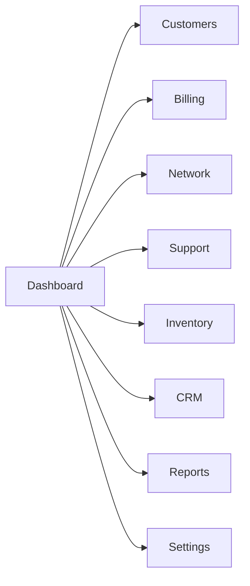

---

# 16. Key Admin Features

### Dashboard

- Income today/month
- Active clients
- Ticket statistics
- Network traffic
- Top downloaders
- Revenue and growth charts

### Client Management

- Client CRUD
- Client details
- Service accounts
- Account status
- Notes
- Tags
- Custom fields
- Invoice/payment/ticket history

### Plans & Services

- PPPoE
- Hotspot
- Static IP
- Upload/download speeds
- FUP
- Burst profiles

### Vouchers

- Generate batches
- Plan assignment
- Expiry
- Status filtering
- Copy/delete
- CSV export

### Billing

- Invoice management
- Payment recording
- M-Pesa
- Cash
- Bank transfer
- Bulk invoice generation
- PDF export

### Network

- Router management
- MikroTik connection testing
- RADIUS sessions
- Network traffic
- NOC
- OLTs
- Fiber
- ONTs

### Support

- Tickets
- Replies
- Assignment
- Escalation
- SLA
- Work orders
- Technicians

### Inventory

- Stock
- Low-stock alerts
- Purchase orders
- Assignments
- Returns

### CRM

- Leads
- Prospects
- Pipeline
- Conversion
- Campaigns
- Customer experience

---

# 17. Client Portal

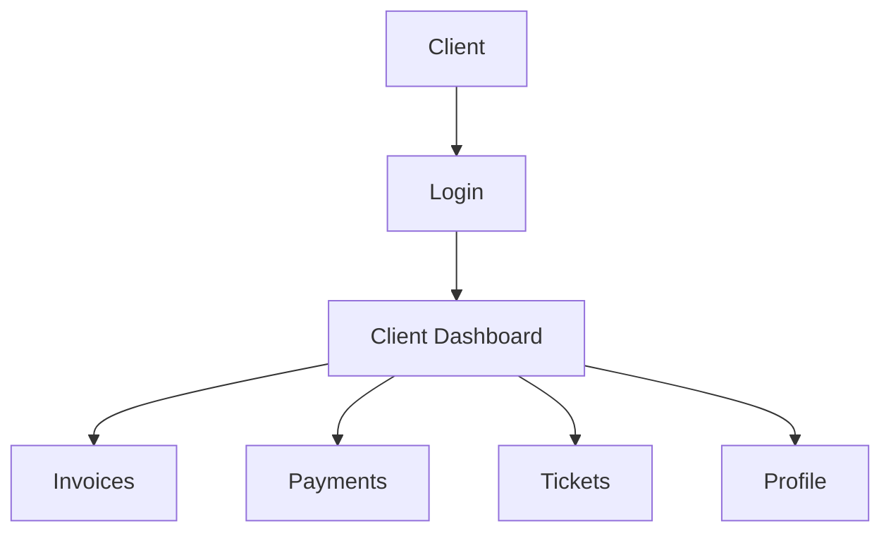

Client portal capabilities include:

- Account status
- Expiry countdown
- Balance
- Invoice history
- M-Pesa self-payment
- Ticket submission
- Ticket replies
- Profile management
- Password management

---

# 18. Public Captive Portal

Route:

```text
/captive/:tenantSlug
```

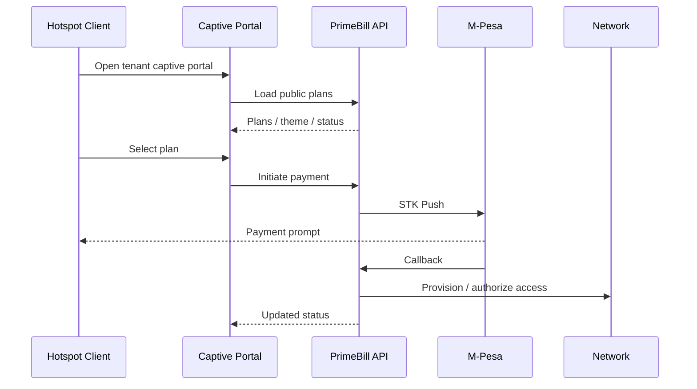

Capabilities:

- Public plan browsing
- Tenant branding
- Status checking
- M-Pesa payment
- Voucher redemption
- No authenticated admin session required

---

# 19. Authentication Architecture

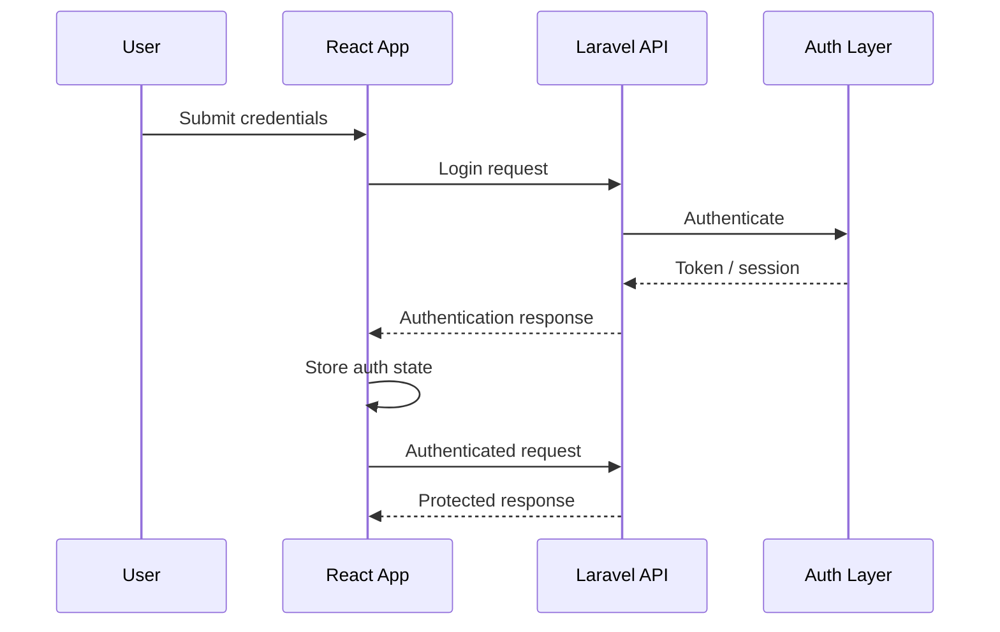

The Axios client handles:

- Base API URL
- Bearer token attachment
- Authentication headers
- 401 handling
- Session expiry redirect

---

# 20. API Data Flow

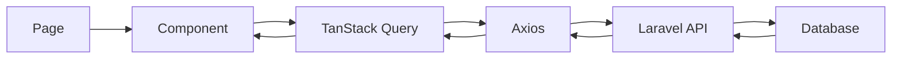

---

# 21. State Management

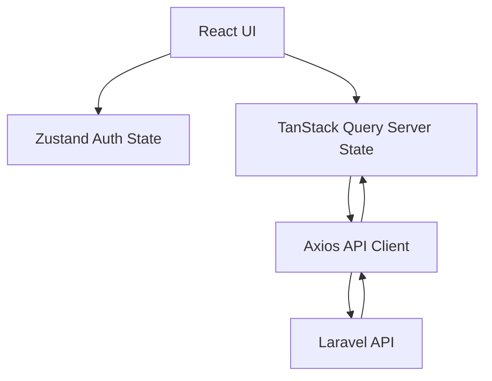

Use:

- **Zustand** for lightweight client/global state.
- **TanStack Query** for server state, caching and request lifecycle.
- **Axios** for HTTP communication.
- React local state for component-specific UI state.

---

# 22. Project Structure

```text
primebill-frontend/
├── src/
│   ├── api/
│   │   ├── axiosInstance.js
│   │   ├── catalog.api.js
│   │   ├── clients.api.js
│   │   ├── invoices.api.js
│   │   ├── platform.api.js
│   │   ├── subscription.api.js
│   │   ├── work-orders.api.js
│   │   └── ...
│   ├── components/
│   │   ├── layout/
│   │   ├── common/
│   │   ├── work-orders/
│   │   └── field-operations/
│   ├── contexts/
│   │   └── AuthContext.jsx
│   ├── layouts/
│   │   ├── PlatformLayout.jsx
│   │   └── ...
│   ├── pages/
│   │   ├── auth/
│   │   ├── dashboard/
│   │   ├── clients/
│   │   ├── plans/
│   │   ├── fup/
│   │   ├── invoices/
│   │   ├── payments/
│   │   ├── tickets/
│   │   ├── sms/
│   │   ├── routers/
│   │   ├── inventory/
│   │   ├── radius/
│   │   ├── noc/
│   │   ├── fiber/
│   │   ├── work-orders/
│   │   ├── subscription/
│   │   ├── finance/
│   │   ├── reports/
│   │   ├── analytics/
│   │   ├── loyalty/
│   │   ├── vouchers/
│   │   ├── leads/
│   │   ├── prospects/
│   │   ├── admin/
│   │   ├── logs/
│   │   ├── settings/
│   │   ├── catalog/
│   │   ├── portal/
│   │   └── platform/
│   ├── routes/
│   │   ├── AppRoutes.jsx
│   │   └── ProtectedRoute.jsx
│   ├── utils/
│   │   ├── formatCurrency.js
│   │   ├── formatDate.js
│   │   └── statusColors.js
│   ├── App.jsx
│   ├── index.css
│   └── main.jsx
├── index.html
├── package.json
├── postcss.config.js
├── tailwind.config.js
└── vite.config.js
```

---

# 23. Technology Stack

| Technology | Version | Purpose |
|---|---|---|
| React | 18 | UI framework |
| Vite | 8 | Build tool |
| TailwindCSS | 4 | Styling |
| React Router DOM | 7 | Routing |
| TanStack Query | 5 | Server state |
| Axios | 1.x | HTTP client |
| Recharts | 3 | Charts |
| Zustand | 5 | Global state |
| Lucide React | 1.x | Icons |
| React Hot Toast | 2.x | Notifications |
| Vitest | Current project version | Testing |
| Testing Library | Current project version | Component testing |
| MSW | Current project version | API mocking |

---

# 24. Routes

| Route | Purpose |
|---|---|
| `/login` | Login |
| `/signup` | Tenant signup |
| `/forgot-password` | Password reset request |
| `/reset-password` | Password reset |
| `/unauthorized` | Unauthorized |
| `/dashboard` | Tenant dashboard |
| `/clients` | Client list |
| `/clients/:id` | Client detail |
| `/plans` | ISP plans |
| `/vouchers` | Vouchers |
| `/fup` | FUP management |
| `/invoices` | Invoices |
| `/payments` | Payments |
| `/tickets` | Tickets |
| `/tickets/:id` | Ticket detail |
| `/sms` | SMS |
| `/routers` | Routers |
| `/radius` | RADIUS |
| `/inventory` | Inventory |
| `/noc` | NOC dashboard |
| `/noc/devices` | NOC devices |
| `/noc/alerts` | NOC alerts |
| `/noc/links` | NOC topology |
| `/fiber/olts` | OLT list |
| `/fiber/olts/:id` | OLT detail |
| `/fiber/map` | Fiber map |
| `/work-orders` | Work orders |
| `/subscription/plans` | SaaS plans |
| `/subscription/my` | Current subscription |
| `/finance` | Finance |
| `/reports` | Reports |
| `/analytics` | Analytics |
| `/loyalty` | Loyalty |
| `/leads` | Leads |
| `/leads/:id` | Lead detail |
| `/prospects` | Prospects |
| `/prospects/:id` | Prospect detail |
| `/admin/users` | Admin users |
| `/admin/roles` | Roles |
| `/logs` | System logs |
| `/settings` | Settings |
| `/catalog` | Catalog |
| `/captive/:tenantSlug` | Captive portal |
| `/platform` | Platform dashboard |
| `/platform/tenants` | Tenants |
| `/platform/tenants/:id` | Tenant detail |
| `/platform/subscriptions` | Platform subscriptions |
| `/platform/analytics` | Platform analytics |
| `/platform/audit-log` | Platform audit log |

---

# 25. Getting Started

## Requirements

- Node.js 20+
- npm 10+
- PrimeBill Laravel API

## Clone

```bash
git clone https://github.com/Onesmuschege/primebill-frontend.git
cd primebill-frontend
```

## Install

```bash
npm install
```

## Environment

Create `.env`:

```env
VITE_API_BASE_URL=http://127.0.0.1:8000/api
```

## Development

```bash
npm run dev
```

Default development URL:

```text
http://localhost:5173
```

---

# 26. Available Scripts

| Command | Description |
|---|---|
| `npm run dev` | Start development server |
| `npm run build` | Production build |
| `npm run preview` | Preview production build |
| `npm run lint` | Run ESLint |
| `npm test` | Run tests |
| `npm run test:watch` | Watch tests |
| `npm run test:ui` | Vitest UI |
| `npm run coverage` | Coverage |

---

# 27. Demo Authentication

After backend seeding:

```text
PrimeNet ISP
primenet-isp.admin@primebill.test
primenet-isp.staff@primebill.test
primenet-isp.support@primebill.test
primenet-isp.technician@primebill.test
primenet-isp.finance@primebill.test

SwiftLink Communications
swiftlink-communications.admin@primebill.test
swiftlink-communications.staff@primebill.test
swiftlink-communications.support@primebill.test
swiftlink-communications.technician@primebill.test
swiftlink-communications.finance@primebill.test

MetroWave Internet
metrowave-internet.admin@primebill.test
metrowave-internet.staff@primebill.test
metrowave-internet.support@primebill.test
metrowave-internet.technician@primebill.test
metrowave-internet.finance@primebill.test
```

Password:

```text
Demo@1234
```

Change demo passwords after first login.

---

# 28. Frontend ↔ Backend Contract

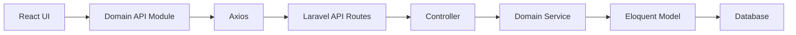

The frontend should not invent backend capabilities.

Where a backend operation is unavailable, the UI should expose a truthful state such as:

- unavailable
- not configured
- coming soon
- integration required
- permission denied
- no data

It should not present a fake successful operation.

---

# 29. UI / UX Principles

PrimeBill's frontend should prioritize:

1. Clear information hierarchy.
2. Consistent navigation.
3. Responsive layouts.
4. Accessible controls.
5. Consistent status indicators.
6. Fast feedback after actions.
7. Loading and empty states.
8. Error states with actionable messages.
9. Confirmation for destructive actions.
10. Tenant-aware data presentation.
11. Permission-aware navigation.
12. Professional ISP/OSS/BSS visual language.

---

# 30. Analytics & Visualization

Recharts is used for:

- Revenue trends
- Client growth
- Payment-method breakdown
- Plan distribution
- Traffic trends
- Network utilization
- Financial summaries

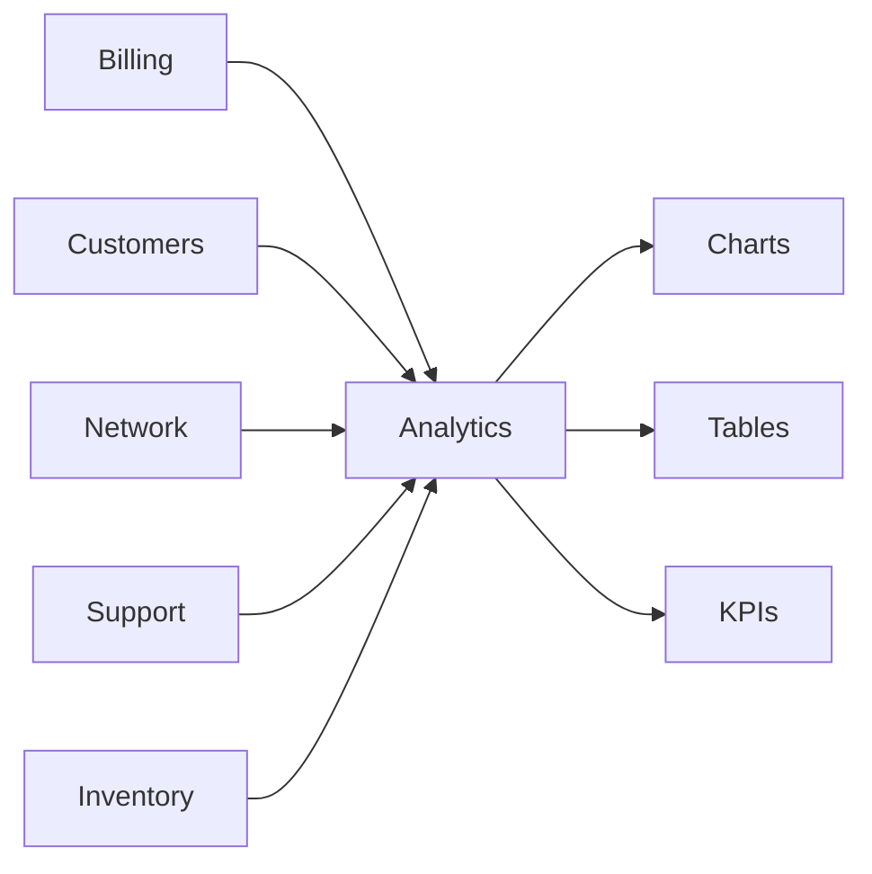

---

# 31. Production Build

```bash
npm run build
```

Build output:

```text
dist/
```

Example Nginx configuration:

```nginx
server {
    listen 80;
    server_name app.primebill.com;

    root /var/www/primebill-frontend/dist;
    index index.html;

    location / {
        try_files $uri $uri/ /index.html;
    }
}
```

The frontend can also be deployed to Vercel or another static hosting provider with:

```env
VITE_API_BASE_URL=https://your-api-domain.example/api
```

---

# 32. Environment Variables

| Variable | Default | Description |
|---|---|---|
| `VITE_API_BASE_URL` | `http://127.0.0.1:8000/api` | Laravel API base URL |

---

# 33. Security Considerations

The frontend must:

- Never hard-code production secrets.
- Never expose M-Pesa consumer secrets.
- Never expose SMS gateway credentials.
- Never assume client-side permissions are sufficient.
- Treat backend authorization as authoritative.
- Handle expired sessions.
- Avoid displaying sensitive data unnecessarily.
- Use HTTPS in production.
- Validate destructive-action confirmations.
- Avoid storing unnecessary sensitive information in browser storage.

---

# 34. Testing Strategy

```mermaid
flowchart TB
    UNIT["Component / Unit Tests"]
    QUERY["Query / API Tests"]
    ROUTES["Route / Guard Tests"]
    E2E["End-to-End Validation"]
    BUILD["Production Build"]

    UNIT --> QUERY
    QUERY --> ROUTES
    ROUTES --> E2E
    E2E --> BUILD
```

Recommended validation before release:

```bash
npm run lint
npm test
npm run build
```

---

# 35. Current Implementation Boundaries

Some UI areas may depend on backend capability or external infrastructure.

Examples:

- MikroTik operations require reachable routers.
- FreeRADIUS operations require RADIUS infrastructure.
- OLT/ONT telemetry requires supported infrastructure.
- M-Pesa operations require configured backend credentials.
- SMS requires an active provider.
- Platform security/system pages may remain placeholders until their backend/API contracts are complete.

The UI should clearly distinguish implemented functionality from unavailable integrations.

---

# 36. Backend Repository

PrimeBill API:

`https://github.com/Onesmuschege/primebill-api`

Frontend repository:

`https://github.com/Onesmuschege/primebill-frontend`

---

# 37. License

Proprietary — All rights reserved.

Unauthorized copying, distribution, modification, or commercial use is prohibited.

---

## PrimeBill Frontend

**A unified web interface for ISP billing, network operations, customer management and PrimeBill SaaS administration.**
